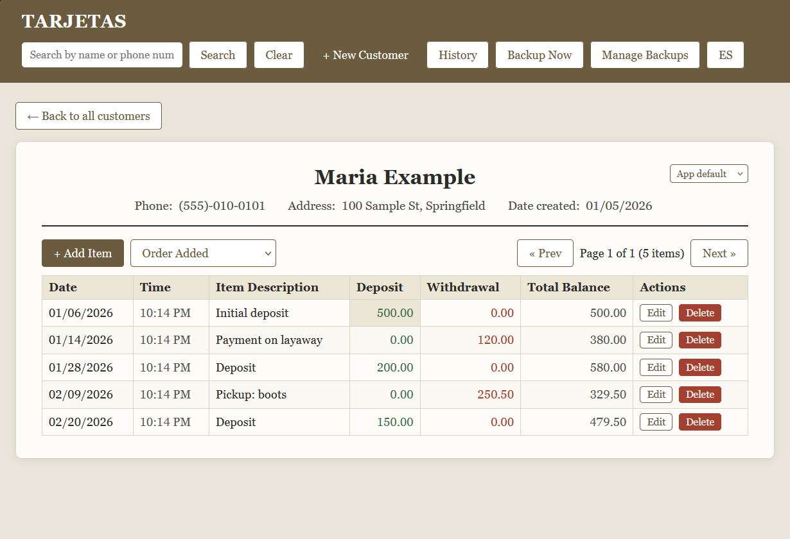

# Customer Ledger

[](LICENSE)

A local desktop app that replaces a paper customer ledger. Each customer gets a
"card" like a ledger sheet: a header (name, phone, address, date created) and a
running table of dated items with deposit, withdrawal and balance. I built it for
a family-owned check-cashing business, where it has been in daily use on-site.
Everything runs on one machine: data lives in a local SQLite file and nothing
leaves the computer.



*Screenshot uses invented sample customers.*

## Features

- **Customer cards** with inline editing: double-click a header field or edit any row.
- **Running balance** computed on the server: a new entry's balance is the previous
  balance plus deposit minus withdrawal. Editing or deleting an old entry
  deliberately doesn't rewrite other balances.
- **Search** by name or phone number: partial, case-insensitive, and punctuation in
  phone numbers is ignored.
- **Input normalization:** phones become `(xxx)-xxx-xxxx`, dates `mm/dd/yyyy`, times
  `h:mm AM/PM`; invalid input is rejected instead of silently mangled.
- **Pagination** (35 items per card by default, set `ENTRIES_PER_PAGE` in `backend/main.py`).
- **Activity history** across one customer or the whole database, with date presets
  (today, week, month, year) and deposit totals for the range.
- **English and Spanish UI**, with a per-customer language override.
- **Automatic backups** on launch and every 30 minutes (last 20 kept), a "Backup Now"
  button, and a Manage Backups panel to restore. Restoring takes a safety backup of
  the current data first, so it is itself undoable.

## Stack

FastAPI, SQLAlchemy, SQLite, Pydantic for validation, and a single-page vanilla
JavaScript frontend with no build step. The desktop version runs the server on a
background thread inside a native window (pywebview), bundled with PyInstaller and
wrapped by an Inno Setup installer.

## Run it

Requires Python 3.9+.

```
cd backend
python -m venv venv
venv\Scripts\activate          # Windows   (source venv/bin/activate on Mac/Linux)
pip install -r requirements.txt
uvicorn main:app --reload
```

Open http://127.0.0.1:8000. The backend serves the frontend itself, so there is
nothing else to start. The database `backend/ledger.db` is created on first run.

Optional: with the app running, `python seed_customers.py` (from the repo root) loads
the invented customers in `customers_seed.json`.

## Project structure

```
backend/
  main.py          FastAPI app and all API endpoints
  models.py        Customer and Entry tables
  schemas.py       request/response validation, phone/date/time normalization
  database.py      SQLite setup and data-folder location
  backup.py        automatic and manual database backups
  launcher.py      desktop-app entry point (used by the packaged .exe)
frontend/
  index.html       the whole UI
```

## Design notes

- Each customer is a row in `customers`; each line item is a row in `entries`, indexed
  by customer, so a card can grow without a fixed page allocation. Pages are computed
  on the fly.
- In the packaged `.exe`, the database lives in `%LOCALAPPDATA%\CustomerLedger\`
  instead of next to the code, because a bundled executable unpacks into a new temp
  folder on every launch and would otherwise lose data between runs.

## Packaging for Windows

[USB_INSTALL_GUIDE.md](USB_INSTALL_GUIDE.md) walks through building the installer and
installing it from a flash drive. The packaging scripts (`build_installer/`) are not
included in this public repo. The native window needs Microsoft's WebView2 runtime,
which ships with current Windows 10 and 11.

## License

MIT, see [LICENSE](LICENSE).
